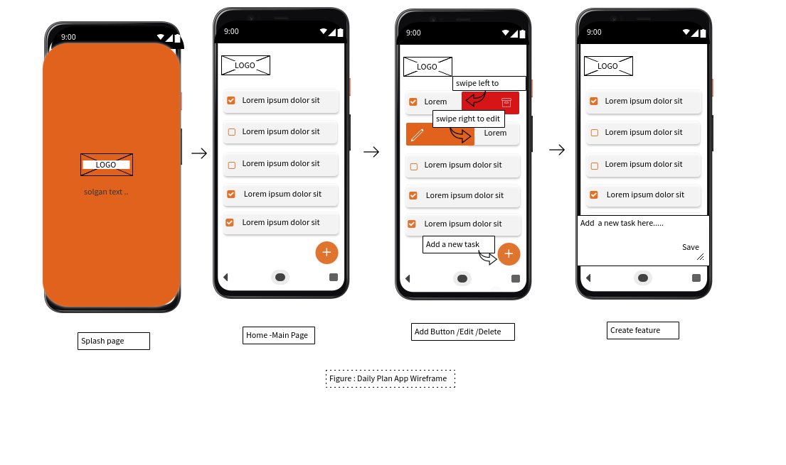

# Intelligent Mobile Developemnt Course

## Introduction

 I plan to develop a Daily Plan, an andriod CRUD application created for users to be able to manage their daily or weekly tasks. Users will be able to add a new task , edit , update and delete tasks.
 
 The app will be made with Recycler View, Card View, and using the SQLite database to store tasks locally.

## Objectives
Enable users to record and keep track of their day to day activities.

## Main Functionality & features
1. Creating, updating and deleting daily task  
2. creating for left and right swipes to edit and delete tasks 
3. Creating a task with a Fab add button at the bottom corner of the application   
4. SQlite database to store & retrieve data 
5. Recylcer View & Card View

## Design
### Wireframe

