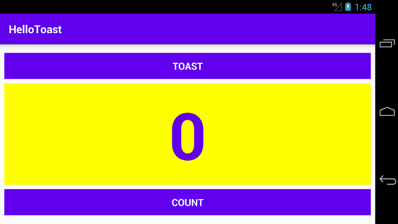

### Assignments  
### Course : Intelligent Mobile Development
### Student Name : Amie Njie
### Student ID: 2120196010
***************************************************************************
 
## Codelab 1.1 - Hello World 

 

### Description
 
After successfully installing Android Studio, I created a new project for the Hello World app. The app simply displays the string "Hello World" on the screen of the Android virtual or physical device  

***************************************************************************

##  Codelab 1.2 part A- First Interaction with UI

### Description
 The second assignment is HelloToast app in portrait setting consisting of two Button elements and one TextView. ConstraintLayout was used to arrange the UI elements in the activity layout file.  

The app works in such a way that When the user taps the first Button, it displays a short message (a Toast) on the screen. Tapping the second Button increases a "click" counter displayed in the TextView, which starts at zero. 

##  Codelab 1.2 part B - Layouts and resources for the UI

### Description
  In the part B of Hello Toast constraintLayout was used in creating the horizontal orientation view and tablet display as shown above

***************************************************************************

## Codelab 2.1 - Activities and intents

 

### Description
 
 Two Activities contains two Activity implementations. The application was developed in three stages.

In the first stage, I created an activity that has one button( Send). When the user clicks this button, the main activity uses an intent to start the second activity.

In the second stage, after adding an EditText view to the main activity. when user enters a message and clicks Send. The main activity uses an intent to start the second activity and send the user's message to the second activity. The second activity displays the message it received.

In the final stage of the Two Activities app, when you add an EditText and a Reply button to the second activity. The user can now type a reply message and tap Reply, and the reply is displayed on the main activity.

 

******************************************************************

## Codelab 2.3: Implicit Intents

 

### Description
 
This Implicit Intent task contains one Activity and three options for actions: open a web site, open a location on a map, and share a snippet of text. All of the text fields are editable (EditText), but contain default values.The receiver matches only exact URI protocol (http) and host (developer.android.com)any other URI opens in the default web browser.
 

****************************************************************
## Codelab 4.1 - -User Interaction Clickable Images (Droid Dessert)

 

### Description
 
 The Droid Cafe app imitates dessert-ordering. After starting a new project based on the Basic Activity template, I deleted the "Hello World" TextView and added Clickable images with text.The user can tap an image to display a Toast message as shown in the figure above. The user can also tap a shopping-cart button to proceed to the next Activity 

***************************************************************************

## Codelab 4.2 -User Interaction  (Input Controls)

 

### Description
 
This is the continuation of the DroidCafe app , I created another activity called Orderactivity added EditedText element for a person's name and address, and an EditText that shows a numeric keypad for entering a phone number.
Other Input Controls includes radio buttons for choosing only one delivery option from several options.  

***************************************************************************

## Codelab 4.4 - -User Interaction (User Navigation)

 

### Description
 
 The final step for Driod Cafe app , I added an Up button (a left-facing arrow) to the app bar for up navigation from the second Activity (OrderActivity) to the parent Activity (MainActivity) 

***************************************************************************

## Codelab 4.5 - RecyclerView

 

### Description
 
This task demonstrates how to use a RecyclerView to display a long scrollable list of words. When you create the dataset (the words), the RecyclerView works in such a way that when a word is tapped it is marked as "clicked".
when the floating action button (FAB) is tapped it adds a new word. 

***************************************************************************

## Codelab 1.1 -Material Design (Cards & Colors) 

 

### Description
 
The MaterialMe app is a mock sports-news app designed using Material Design features such as CardView, which is a FrameLayout with some extra features (such as elevation and rounded corners) that gives the application a consistent look, beautiful design and amazing user experience across platforms. Aslo  Glide, which uses background processing, as well some other complex processing, to reduce the memory requirements of loading images   

***************************************************************************

## Codelab 7.2 - AsyncTask & AsyncTaskLoader 

 

### Description
 
AsyncTask and AsyncTaskLoader app ,allows users enter the name of the book in the EditText and taps the button.
The button executes an AsyncTask that queries the Google Books API to find the author and title of the book the user is looking for.
The results are retrieved should displayed in a TextView below the button. 

***************************************************************************

## Codelab 8.1 - Notification

 

### Description
 
Notify Me! is an appliaction that lets the user trigger, update, and cancel a notification using the three buttons shown in the screenshots below.Notify Me! is an app that lets the user trigger, update, and cancel a notification using the three buttons shown in the screenshots below.After creating the notification styles, actions once you click on the notify me button for example , it displays a notication 

***************************************************************************

## Codelab 9.1 - Shared Preferences

 

### Description
 
The HelloSharedPrefs application includes buttons such as (Count button) to increment the number, (color buttons) to change the background color, and the reset button to reset both the number and color to their defaults. 
 

***************************************************************************
